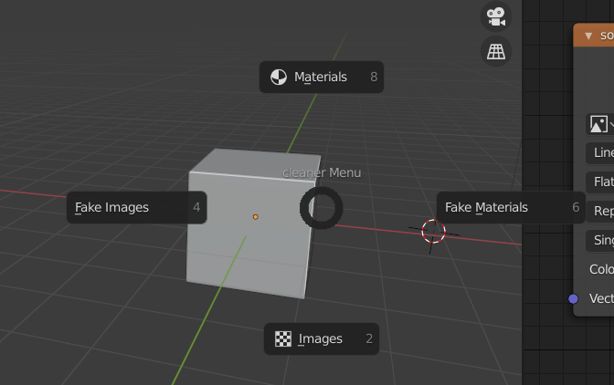

## 1，工具介绍

This is the tool whose function is to clean additional images and materials in blender ,as following.

该工具用于清理在blender中多余的图片和材质，如下:

## 2，功能说明

快捷键默认为：**clt c**。

materias：清除多余的材质

images：清除多余的图片

facke：清除材质或者图片的fake标签

