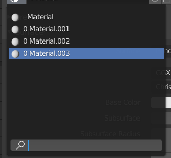
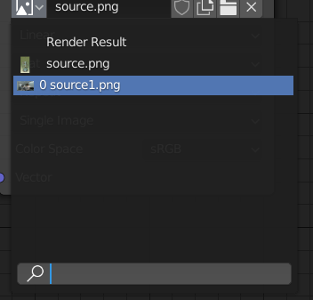
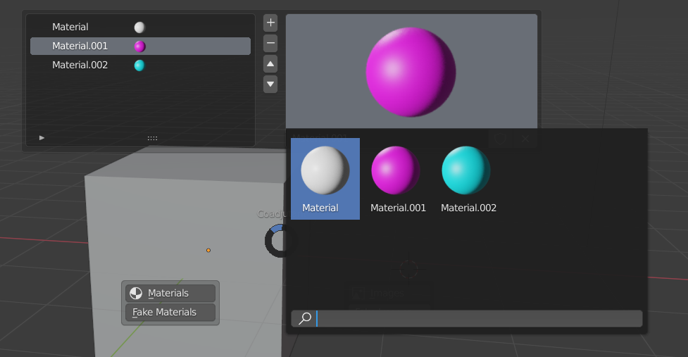
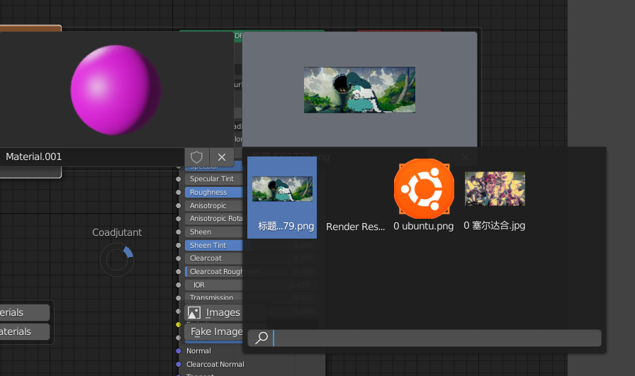
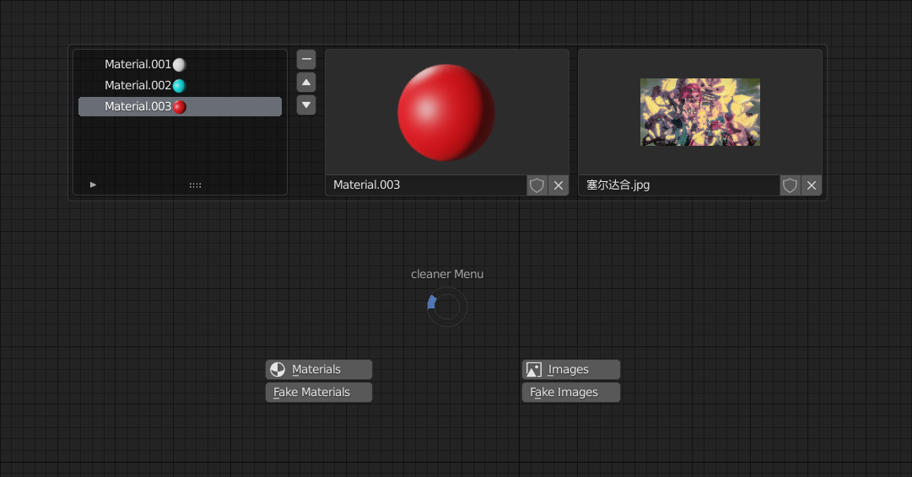
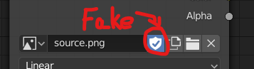

## 1，工具介绍

This is the tool whose function are to view materials and images,and clean additional images and materials in blender ,as following.

该工具用于清理在blender中多余的图片和材质，查看图片和材质，如下:

### 1.1 多余的材质和贴图

### 1.2 查看材质和图片

## 2，功能说明

快捷键默认为：**clt c**。

图片和材质与激活的物体和图像节点是关联的

materias：清除多余的材质

images：清除多余的图片

hdri: 清除方法和images一样

facke：清除材质或者图片的fake标签

